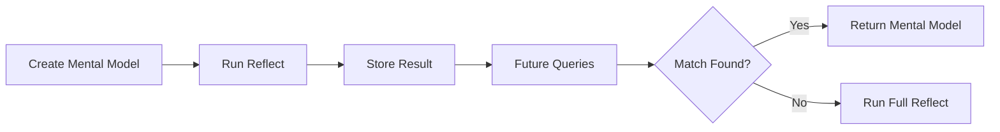

# Mental Models

User-curated summaries that provide high-quality, pre-computed answers for common queries.

{/* Import raw source files */}

## What Are Mental Models?

Mental models are **saved reflect responses** that you curate for your memory bank. When you create a mental model, Hindsight runs a reflect operation with your source query and stores the result. During future reflect calls, these pre-computed summaries are checked first — providing faster, more consistent answers.



### Why Use Mental Models?

| Benefit | Description |
|---------|-------------|
| **Consistency** | Same answer every time for common questions |
| **Speed** | Pre-computed responses are returned instantly |
| **Quality** | Manually curated summaries you've reviewed |
| **Control** | Define exactly how key topics should be answered |

### Hierarchical Retrieval

During reflect, the agent checks sources in priority order:

1. **Mental Models** — User-curated summaries (highest priority)
2. **Observations** — Consolidated knowledge
3. **Raw Facts** — Ground truth memories

Mental models are checked first because they represent your explicitly curated knowledge.

---

## Create a Mental Model

Creating a mental model runs a reflect operation in the background and saves the result:

### Python

```python
# Create a mental model (runs reflect in background)
result = client.create_mental_model(
    bank_id=BANK_ID,
    name="Team Communication Preferences",
    source_query="How does the team prefer to communicate?",
    tags=["team", "communication"]
)

# Returns an operation_id - check operations endpoint for completion
print(f"Operation ID: {result.operation_id}")
```

### Node.js

```javascript
// Create a mental model (runs reflect in background)
const result = await client.createMentalModel(
    BANK_ID,
    'Team Communication Preferences',
    'How does the team prefer to communicate?',
    { tags: ['team', 'communication'] },
);

// Returns an operation_id — check operations endpoint for completion
console.log(`Operation ID: ${result.operation_id}`);
```

### CLI

```bash
# Create a mental model (runs reflect in background)
hindsight mental-model create "$BANK_ID" \
  "Team Communication Preferences" \
  "How does the team prefer to communicate?"
```

### Go

```go
# Section 'create-mental-model' not found in api/mental-models.go
```

### Parameters

| Parameter | Type | Required | Description |
|-----------|------|----------|-------------|
| `name` | string | Yes | Human-readable name for the mental model |
| `source_query` | string | Yes | The query to run to generate content |
| `id` | string | No | Custom ID for the mental model (alphanumeric lowercase with hyphens). Auto-generated if omitted. |
| `tags` | list | No | Tags for filtering during retrieval |
| `max_tokens` | int | No | Maximum tokens for the mental model content |
| `trigger` | object | No | Trigger settings (see [Automatic Refresh](#automatic-refresh)) |

---

## Create with Custom ID

Assign a stable, human-readable ID to a mental model so you can retrieve or update it by name instead of relying on the auto-generated UUID:

### Python

```python
# Create a mental model with a specific custom ID
result_with_id = client.create_mental_model(
    bank_id=BANK_ID,
    name="Communication Policy",
    source_query="What are the team's communication guidelines?",
    id="communication-policy"
)

print(f"Created with custom ID: {result_with_id.operation_id}")
```

### Node.js

```javascript
// Create a mental model with a specific custom ID
const resultWithId = await client.createMentalModel(
    BANK_ID,
    'Communication Policy',
    "What are the team's communication guidelines?",
    { id: 'communication-policy' },
);

console.log(`Created with custom ID: ${resultWithId.operation_id}`);
```

### CLI

```bash
# Create a mental model with a specific custom ID
hindsight mental-model create "$BANK_ID" \
  "Communication Policy" \
  "What are the team's communication guidelines?" \
  --id communication-policy
```

### Go

```go
# Section 'create-mental-model-with-id' not found in api/mental-models.go
```

:::tip
Custom IDs must be lowercase alphanumeric and may contain hyphens (e.g. `team-policies`, `q4-status`). If a mental model with that ID already exists, the request is rejected.
---

## Automatic Refresh

Mental models can be configured to **automatically refresh** when observations are updated. This keeps them in sync with the latest knowledge without manual intervention.

### Trigger Settings

| Setting | Type | Default | Description |
|---------|------|---------|-------------|
| `refresh_after_consolidation` | bool | false | Automatically refresh after observations consolidation |

When `refresh_after_consolidation` is enabled, the mental model will be re-generated every time the bank's observations are consolidated — ensuring it always reflects the latest synthesized knowledge.

### Python

```python
# Create a mental model with automatic refresh enabled
result = client.create_mental_model(
    bank_id=BANK_ID,
    name="Project Status",
    source_query="What is the current project status?",
    trigger={"refresh_after_consolidation": True}
)

# This mental model will automatically refresh when observations are updated
print(f"Operation ID: {result.operation_id}")
```

### Node.js

```javascript
// Create a mental model with automatic refresh enabled
const result2 = await client.createMentalModel(
    BANK_ID,
    'Project Status',
    'What is the current project status?',
    { trigger: { refreshAfterConsolidation: true } },
);

// This mental model will automatically refresh when observations are updated
console.log(`Operation ID: ${result2.operation_id}`);
```

### CLI

```bash
# Create a mental model and get its ID for subsequent operations
hindsight mental-model create "$BANK_ID" \
  "Project Status" \
  "What is the current project status?"
```

### Go

```go
# Section 'create-mental-model-with-trigger' not found in api/mental-models.go
```

### When to Use Automatic Refresh

| Use Case | Automatic Refresh | Why |
|----------|-------------------|-----|
| **Real-time dashboards** | ✅ Enabled | Status should always be current |
| **Policy summaries** | ❌ Disabled | Policies change infrequently, manual refresh preferred |
| **User preferences** | ✅ Enabled | Preferences evolve with new interactions |
| **FAQ answers** | ❌ Disabled | Answers are curated, should be reviewed before updating |

:::tip
Enable automatic refresh for mental models that need to stay current. Disable it for curated content where you want to review changes before they go live.
---

## List Mental Models

### Python

```python
# List all mental models in a bank
mental_models = client.list_mental_models(bank_id=BANK_ID)

for mental_model in mental_models.items:
    print(f"- {mental_model.name}: {mental_model.source_query}")
```

### Node.js

```javascript
// List all mental models in a bank
const mentalModels = await client.listMentalModels(BANK_ID);

for (const mm of mentalModels.items) {
    console.log(`- ${mm.name}: ${mm.source_query}`);
}
```

### CLI

```bash
# List all mental models in a bank
hindsight mental-model list "$BANK_ID"
```

### Go

```go
# Section 'list-mental-models' not found in api/mental-models.go
```

---

## Get a Mental Model

### Python

```python
# Section 'get-mental-model' not found in api/mental-models.py
```

### Node.js

```javascript
// Get a specific mental model
const mentalModel = await client.getMentalModel(BANK_ID, mentalModelId);

console.log(`Name: ${mentalModel.name}`);
console.log(`Content: ${mentalModel.content}`);
console.log(`Last refreshed: ${mentalModel.last_refreshed_at}`);
```

### CLI

```bash
# Section 'get-mental-model' not found in api/mental-models.sh
```

### Go

```go
# Section 'get-mental-model' not found in api/mental-models.go
```

### Response Fields

| Field | Type | Description |
|-------|------|-------------|
| `id` | string | Unique mental model ID |
| `bank_id` | string | Memory bank ID |
| `name` | string | Human-readable name |
| `source_query` | string | The query used to generate content |
| `content` | string | The generated mental model text |
| `tags` | list | Tags for filtering |
| `last_refreshed_at` | string | When the mental model was last updated |
| `created_at` | string | When the mental model was created |
| `reflect_response` | object | Full reflect response including `based_on` facts |

---

## Refresh a Mental Model

Re-run the source query to update the mental model with current knowledge:

### Python

```python
# Section 'refresh-mental-model' not found in api/mental-models.py
```

### Node.js

```javascript
// Refresh a mental model to update with current knowledge
const refreshResult = await client.refreshMentalModel(BANK_ID, mentalModelId);

console.log(`Refresh operation ID: ${refreshResult.operation_id}`);
```

### CLI

```bash
# Section 'refresh-mental-model' not found in api/mental-models.sh
```

### Go

```go
# Section 'refresh-mental-model' not found in api/mental-models.go
```

Refreshing is useful when:
- New memories have been retained that affect the topic
- Observations have been updated
- You want to ensure the mental model reflects current knowledge

---

## Update a Mental Model

Update the mental model's name:

### Python

```python
# Section 'update-mental-model' not found in api/mental-models.py
```

### Node.js

```javascript
// Update a mental model's metadata
const updated = await client.updateMentalModel(BANK_ID, mentalModelId, {
    name: 'Updated Team Communication Preferences',
    trigger: { refresh_after_consolidation: true },
});

console.log(`Updated name: ${updated.name}`);
```

### CLI

```bash
# Section 'update-mental-model' not found in api/mental-models.sh
```

### Go

```go
# Section 'update-mental-model' not found in api/mental-models.go
```

---

## Delete a Mental Model

### Python

```python
# Section 'delete-mental-model' not found in api/mental-models.py
```

### Node.js

```javascript
// Delete a mental model
await client.deleteMentalModel(BANK_ID, mentalModelId);
```

### CLI

```bash
# Section 'delete-mental-model' not found in api/mental-models.sh
```

### Go

```go
# Section 'delete-mental-model' not found in api/mental-models.go
```

---

## Tags and Visibility

Mental models support the same tag system as memories. When you assign tags to a mental model, those tags control both **which memories it reads** during refresh and **when it is surfaced** during reflect.

### How tags affect mental model refresh

When a mental model is refreshed (manually or automatically), it runs an internal reflect call to regenerate its content. If the mental model has tags, that reflect call uses `all_strict` tag matching — meaning it will only read memories that carry **all** of the mental model's tags. Untagged memories are excluded.

```
Mental model tags: ["user:alice"]

During refresh, it reads:
  ✅ "Alice prefers async communication"     — has "user:alice"
  ✅ "Team uses Slack for announcements"      — has "user:alice" (plus other tags)
  ❌ "Company policy: no meetings on Fridays" — untagged, excluded
  ❌ "Bob dislikes long meetings"             — no "user:alice" tag
```

This means a mental model tagged `["user:alice"]` will also pick up memories tagged `["user:alice", "team"]` — extra tags on a memory don't disqualify it. Only the mental model's own tags are required to be present.

### How tags affect mental model lookup during reflect

When you call `reflect` with tags, those same tags are used to filter which mental models the agent can see. A mental model is visible only if its tags overlap with the tags on the reflect request.

For more details on tag matching modes (`any`, `any_strict`, `all`, `all_strict`) and worked examples, see the [Recall tags reference](./recall#tags).

---

## History

Every time a mental model's content changes (via refresh or manual update), the previous version is saved with a timestamp. You can retrieve the full change log with the history endpoint:

### Python

```python
# Section 'get-mental-model-history' not found in api/mental-models.py
```

### Node.js

```javascript
// Get the change history of a mental model
const history = await client.getMentalModelHistory(BANK_ID, mentalModelId);

for (const entry of history) {
    console.log(`Changed at: ${entry.changed_at}`);
    console.log(`Previous content: ${entry.previous_content}`);
}
```

### CLI

```bash
# Section 'get-mental-model-history' not found in api/mental-models.sh
```

### Go

```go
# Section 'get-mental-model-history' not found in api/mental-models.go
```

### Response

The endpoint returns a list of history entries, most recent first:

| Field | Type | Description |
|-------|------|-------------|
| `previous_content` | string \| null | The content before this change (`null` if not available) |
| `changed_at` | string | ISO 8601 timestamp of when the change occurred |

Each entry captures the **content before the change** and when it happened. The current content is returned by the standard [Get a Mental Model](#get-a-mental-model) endpoint.

:::note
History tracking is enabled by default. Set `HINDSIGHT_API_ENABLE_MENTAL_MODEL_HISTORY=false` to disable it.
---

## Use Cases

| Use Case | Example |
|----------|---------|
| **FAQ Answers** | Pre-compute answers to common customer questions |
| **Onboarding Summaries** | "What should new team members know?" |
| **Status Reports** | "What's the current project status?" refreshed weekly |
| **Policy Summaries** | "What are our security policies?" |

---

## Next Steps

- [**Reflect**](./reflect) — How the agentic loop uses mental models
- [**Observations**](../observations.md) — How knowledge is consolidated
- [**Operations**](./operations) — Track async mental model creation
